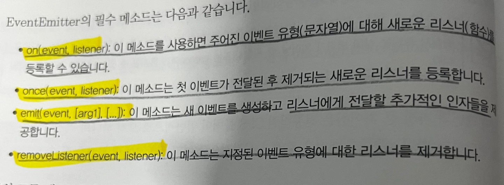

# Node.js-DesignPatternBibble
node.js 디자인 패턴 바이블 도서 스터디


❌콜백 함수라고 해서 무조건 비동기는 아니다 ex) map함수 <br>

<h1> 지연 실행 <h1>

동기를 비동기로 처리하기<br>

```
function inconsist(filename, cb){
  if(cache.has(filename)){
   cb(cache.get(filename))}
else{
readFile(filename,'utf8',(err,data) =>{
cache.set(filename,data)
})
}

```
위 함수를<br>
process.nextTick(()=> callback(cache...)) <br>
or<br>
setImmediate() 사용<br>

둘의 차이점은 <br>
nextTick()은 백그라운드이후에 바로 실행 1순위가 된다. 하지만 재귀함수 실행일 경우 기아가 올 수 있다.<br>

setImmediate()는 태스크 큐에 들어간다.<br>

<h1> 관찰자 패턴 <h1>
=> 특정 이벤트가 일어났을 때, 확인 하기 위해 관찰자를 붙임

(관찰자 함수 이미지)




